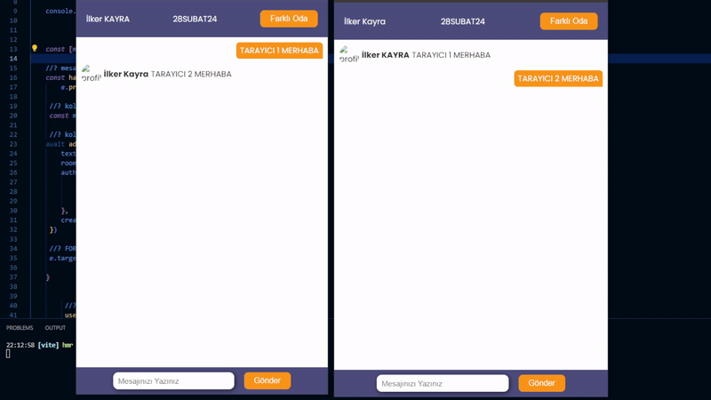

🔥 React - Firebase Chat App 🔥

Bu proje, Google Firebase altyapısını kullanarak geliştirilmiş bir sohbet uygulamasıdır. Uygulamaya Google Kimlik Doğrulama özelliği entegre edilmiştir, böylece kullanıcılar Google hesaplarıyla giriş yapabilirler. Sohbet odası adı girilerek ilgili odaya katılabilir ve kullanıcılar arası iletişim sağlanabilir. Mesajlar, Firebase Firestore veritabanında depolanır ve bu sayede gerçek zamanlı olarak gönderilip alınabilir.

🚀 Özellikler:

Google Kimlik Doğrulama ile giriş yapma
Sohbet odalarına katılma ve mesajlaşma
Firebase Firestore kullanarak gerçek zamanlı veritabanı iletişimi
Bu proje, Firebase ve React kullanarak gerçek zamanlı veritabanı iletişimi konusunda bilgi edinmek isteyenler için harika bir örnek olabilir. Hem kullanıcı dostu arayüzüyle hem de güçlü altyapısıyla dikkat çekici bir deneyim sunar.

----------   ----------   ----------   ----------   -----------

🔥 React - Firebase Chat App 🔥

This project is a chat application developed using the Google Firebase infrastructure. Google Authentication is integrated into the application, allowing users to sign in with their Google accounts. Users can join chat rooms by entering the room name and communicate with each other. Messages are stored in Firebase Firestore database, enabling real-time sending and receiving.

🚀 Features:

Sign in with Google Authentication
Join chat rooms and communicate
Real-time database communication using Firebase Firestore
This project can serve as a great example for those interested in learning about real-time database communication using Firebase and React. With its user-friendly interface and robust infrastructure, it provides an engaging experience.
